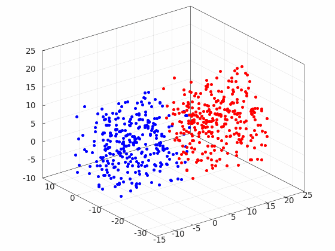
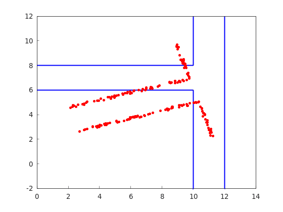

# mathematical_robotics

[](https://github.com/TakumaNakao/mathematical_robotics/actions/workflows/build.yml)

## 環境
* CMake
* Eigen3
* Ceres Solver
* Matplot++

## Docker
以下のコマンドでDockerを起動できる
```
bash docker_bringup.sh
```

## point_cloud_matching
リー群による剛体変換を用いた3次元点群のマッチング  
最適化にはCeres Solverを使用  

### 例


## point_cloud_to_line_matching
点群と2次元平面上の線分をマッチングする  

### 例

